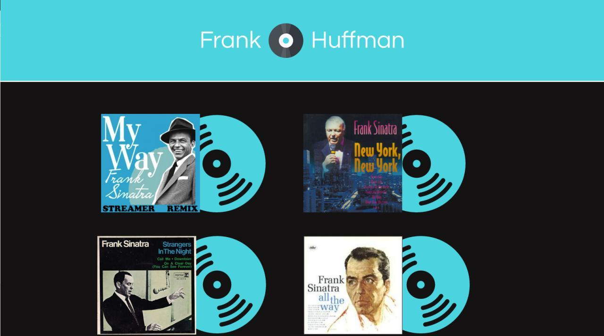
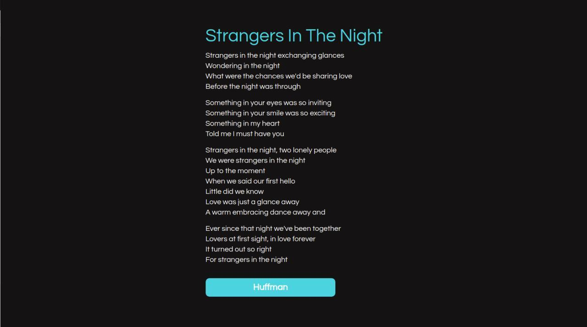
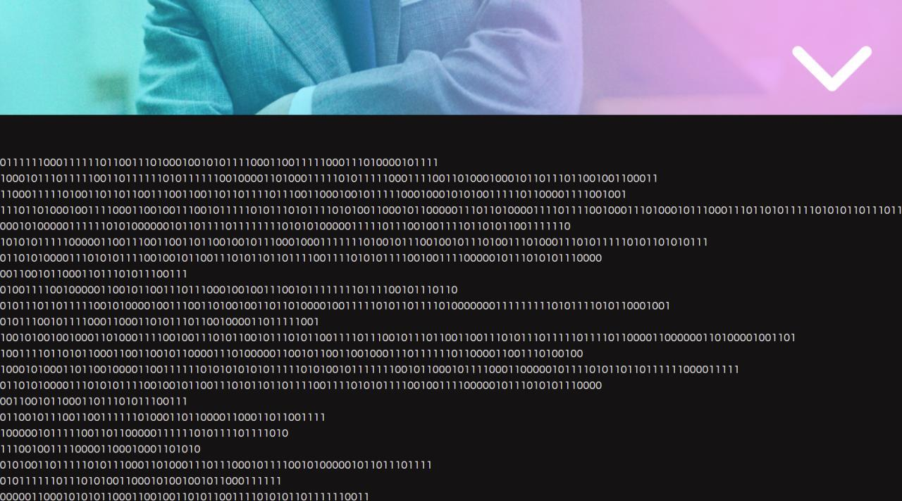

# Frank Huffman

**Número da Lista**: 3<br>
**Conteúdo da Disciplina**: Greed<br>

## Alunos
|Matrícula | Aluno |
| -- | -- |
| 17/0062686 |  Pedro Rodrigues Pereira |
| 17/0008371 |  Daniel de Sousa Oliveira Melo Veras |

## Sobre
José Antonio, grande entusiasta dos discos de vinil, decidiu tirar poeira de sua coleção e relembrar grandes sucessos do seu idolo de infância, Frank Sinatra. Como um bom programador, decidiu dar uma pitada mais emociante as coisas simples do cotidiano. Ao se deparar procurando as letras das canções, pensou que elas poderiam ser convertidas ao código de Huffman e assim nasceu Frank Huffman, seu projetinho de final de semana.

## Screenshots

### Seleção de música



### Letra antes da conversão



### Letra em Huffman




## Instalação 
**Linguagem**: Javascript e Python<br>
**Framework**: ReactJS e Flask<br>
<br>
Para fazer uso do projeto se faz necessário possuir o Docker e Docker-compose.

1. Primeiro passo é realizar o download do repositório com o seguinte comando:

```
$ git clone https://github.com/projeto-de-algoritmos/Greed_Frank.git
```


2. Após o download, acesse a pasta base do projeto:

```
$ cd Greed_Frank
```

3. Agora basta rodar o seguinte comando do docker

```
$ docker-compose up --build
```

## Uso 
Após a execução do container docker, se faz necessário abrir seu navegador de preferência e acessar o link:

**http://localhost:3000/**

A partir desse ponto, é demonstrada a seleção de músicas. Basta selecionar uma e clicar. A música em questão começa a tocar automaticamente e arrastando para baixo se tem a letra junto ao respectivo botão de conversão para Huffman.


